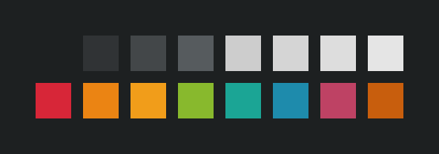

# base16-preview

I whipped this project up because I wanted an easy way to generate a preview image for my base16 colorscheme, [helios](https://github.com/reyemxela/base16-helios-scheme).  
I initially used PIL to generate the image, but eventually moved to just generating an SVG image manually. So now this project doesn't need any external dependencies (just python3).  

I'm putting this project out here because a lot of base16 scheme repos I've seen don't have any sort of preview, so I wanted there to be an easy and standardized-ish way to make a quick preview image.

## Example usage

### Default settings:
`python base16-preview.py helios.yaml`

  

### Customized:
`python base16-preview.py helios.yaml --rows 4 --tilesize 80 --gapsize 25 --output output2.svg`

  

